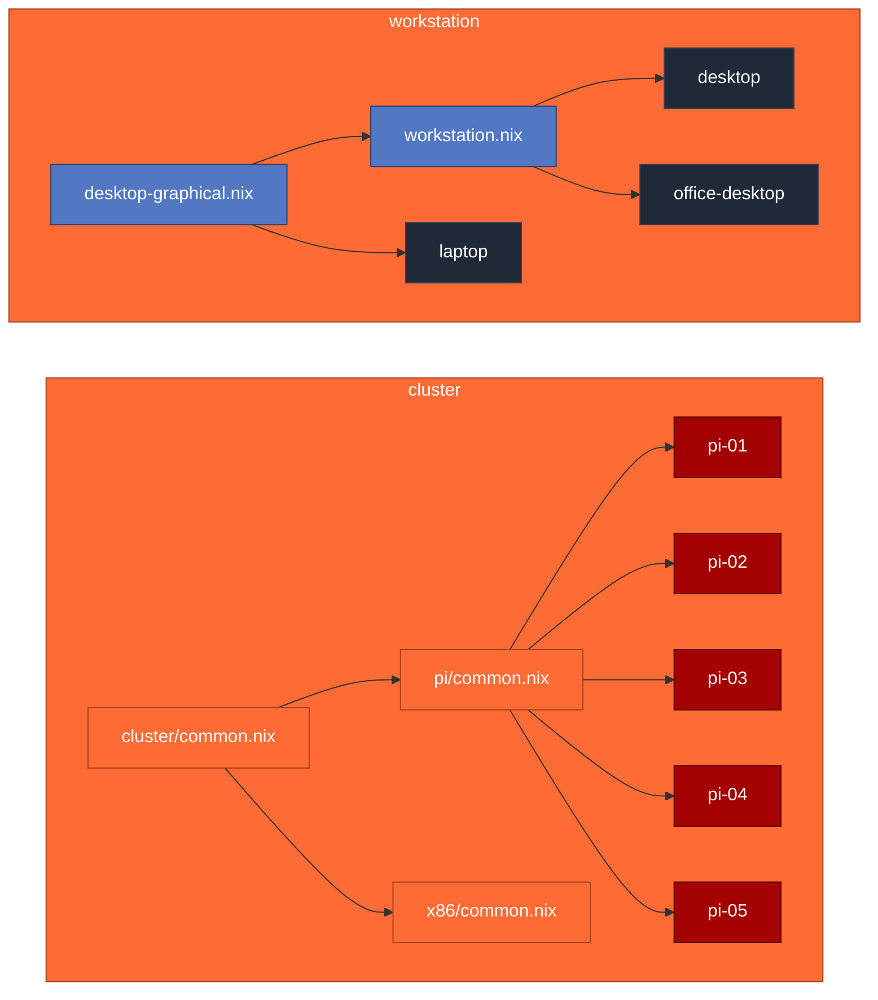

<div align="center">


# dotfiles


</div>

---

```bash
sudo nixos-rebuild switch --flake .#<host>
```

<table>
<tr>
<td valign="top" width="50%">

### Hosts

| host             | kind            | builder             |
| :--------------- | :-------------- | :------------------ |
| `desktop`        | workstation     | `nixpkgs`           |
| `office-desktop` | workstation     | `nixpkgs`           |
| `laptop`         | workstation     | `nixpkgs`           |
| `wsl`            | side            | `nixpkgs`           |
| `cluster-pi-0X`  | incus node ×5   | `nixos-raspberrypi` |

</td>
<td valign="top" width="50%">

### Stack

| layer        | tool                |
| :----------- | :------------------ |
| OS           | NixOS 26.05         |
| User env     | Home Manager        |
| Compositor   | Hyprland (Wayland)  |
| Login        | SDDM                |
| IME          | kime (dubeolsik)    |
| Orchestrator | Incus               |
| Secrets      | agenix              |

</td>
</tr>
</table>

### Architecture



### Layout

```text
hosts/
├── _shared/
│   ├── desktop-graphical.nix    # hyprland, sddm, kime, fonts
│   └── workstation.nix          # grub, operator CLIs
├── <host>/                      # per-machine
└── cluster/
    ├── common.nix               # incus, agenix, nftables
    ├── pi/                      # aarch64 (Pi 5 default)
    └── x86/                     # future joiners
secrets/                         # agenix recipients (repo-wide)
modules/common/
home-manager/
```

### Cluster

Two layers, kept apart: **declared** config converges on every deploy; **runtime**
state (tailscale auth, host identity, the incus cluster db) is created once and
outlives deploys. The SD image is a one-time bootstrap — after first boot it's
`nixos-rebuild`, never a re-flash.

```bash
# 0. build the one-time bootstrap image (deployed config + bootstrap overlay)
just image                    # -> .#packages.aarch64-linux.image-pi-0X

# 1. flash, then inject first-boot credentials on the FIRMWARE partition.
#    Nothing here is baked into the image, so it carries no secret.
zstdcat result-pi-01/sd-image/*.img.zst | sudo dd of=/dev/sdX bs=4M status=progress conv=fsync
F=/run/media/$USER/FIRMWARE
printf 'ssid=MyNetwork\npsk=hunter2\n' > $F/wifi.conf   # optional, wireless first boot
echo tskey-auth-... > $F/ts-authkey                     # optional, headless tailnet join

# 2. enroll: the node's identity only exists now. Register its host key, then rekey.
#    (printed to console + written to /boot/firmware/cluster-pi-0X.hostkey.pub)
just agenix                   # or: ssh ...pubkey -> secrets/secrets.nix; ( cd secrets && agenix -r )

# 3. wireless-only node? create the steady-state Wi-Fi secret BEFORE deploying.
( cd secrets && agenix -e wifi.age )   # contents: a wpa_supplicant.conf

# 4. first deploy converges the clean config; the bootstrap overlay disappears
#    and SSH becomes tailscale-only from here on.
just deploy pi-01

# 5. cluster: hand-wire ONCE, then leave the runtime state alone (never in Nix).
sudo incus admin init                          # on cluster-pi-01
sudo incus admin init --preseed < join.yaml    # each other node

# operate from a workstation
incus remote add home https://cluster-pi-01:8443
```

**Wi-Fi.** Two separate mechanisms for the two phases, because a node's identity
doesn't exist until it has booted once. During bootstrap, credentials are read from
`/boot/firmware/wifi.conf` — injected at flash time, never in the Nix store. That
file accepts `ssid=`/`psk=` lines or a full `network={...}` block, and unlike the
tailscale key it is *not* shredded, so reboots before the first deploy still work.
In steady state, `secrets/wifi.age` holds a complete `wpa_supplicant.conf` and the
units only exist when that file does. **A wireless-only node with no `wifi.age` drops
off the network the moment the first deploy converges** — the bootstrap overlay, and
with it the FIRMWARE-based Wi-Fi, is gone by then.

**Clock.** A Pi 5 with no RTC battery boots with a clock from far in the past, and that
deadlocks the node on first boot: `nix-base.nix` sets `DNSOverTLS` and `DNSSEC` to strict,
both of which validate certificates against the wrong time and fail, so DNS resolves
nothing — including the NTP pool hostnames that would have fixed the clock. The pi nodes
therefore point `timesyncd` at NTP servers by IP literal, which needs no DNS at all. Once
one sync lands, systemd persists the timestamp and later boots start from it. If a node
ever comes up unreachable with TLS errors in `journalctl -u tailscaled`, check `date`
first.

**Access.** Cluster nodes take key auth only: `PasswordAuthentication = false` and
`PermitRootLogin = "prohibit-password"`, with the operator key on both `root` and the
user account. The console password remains as a physical-access fallback. `just deploy`
therefore runs as `root` unattended; set `DEPLOY_USER=<user>` to go through sudo instead.

From here on every change is `just deploy` — it builds all targets locally first (a
build failure never reaches a node), refuses to start if a cluster member is already
offline, then walks the nodes one at a time: evacuate → switch → reboot only if the
kernel changed → wait for `ONLINE` → restore. Containers migrate to the other members
instead of going down, and a failure stops the rollout rather than continuing into it.

Rollback is the one thing the Pi makes awkward: `bootloader = "kernel"` keeps the last
`configurationLimit` generations on the FIRMWARE partition, but there is no boot menu.
If the node still answers SSH, `nixos-rebuild --rollback` is enough; if it doesn't boot
at all, recovery means pulling the card and pointing `os_prefix=` at an older
`nixos/<gen>-default/`. That asymmetry is why `deploy` only reboots when the kernel
actually changed.

<details>
<summary><b>Secrets</b></summary>

```bash
just agenix     # interactive: register operator + host keys, then rekey
# …or by hand:
ssh root@cluster-pi-0X cat /etc/ssh/ssh_host_ed25519_key.pub   # -> secrets/secrets.nix
( cd secrets && agenix -r )
```

</details>

<details>
<summary><b>Per-node override</b></summary>

```nix
# hosts/cluster/pi/pi-0X.nix
{ ... }: {
  hardware.raspberry-pi."5".i2c.enable = true;
}
```

</details>

<details>
<summary><b>Adding an x86 node</b></summary>

Declare via `mkClusterX86` in `flake.nix`, drop a file in `hosts/cluster/x86/`, then `incus cluster add`.

</details>

<details>
<summary><b>Copilot in the shell</b></summary>

`?? <natural language>` suggests a command, `? <cmd>` explains one (zsh, via `gh copilot -p`).

```bash
gh auth login          # once, if not already
gh copilot             # once in a real terminal — downloads the Copilot CLI
# if the download fails on NixOS:
npm install -g @github/copilot
```

</details>
