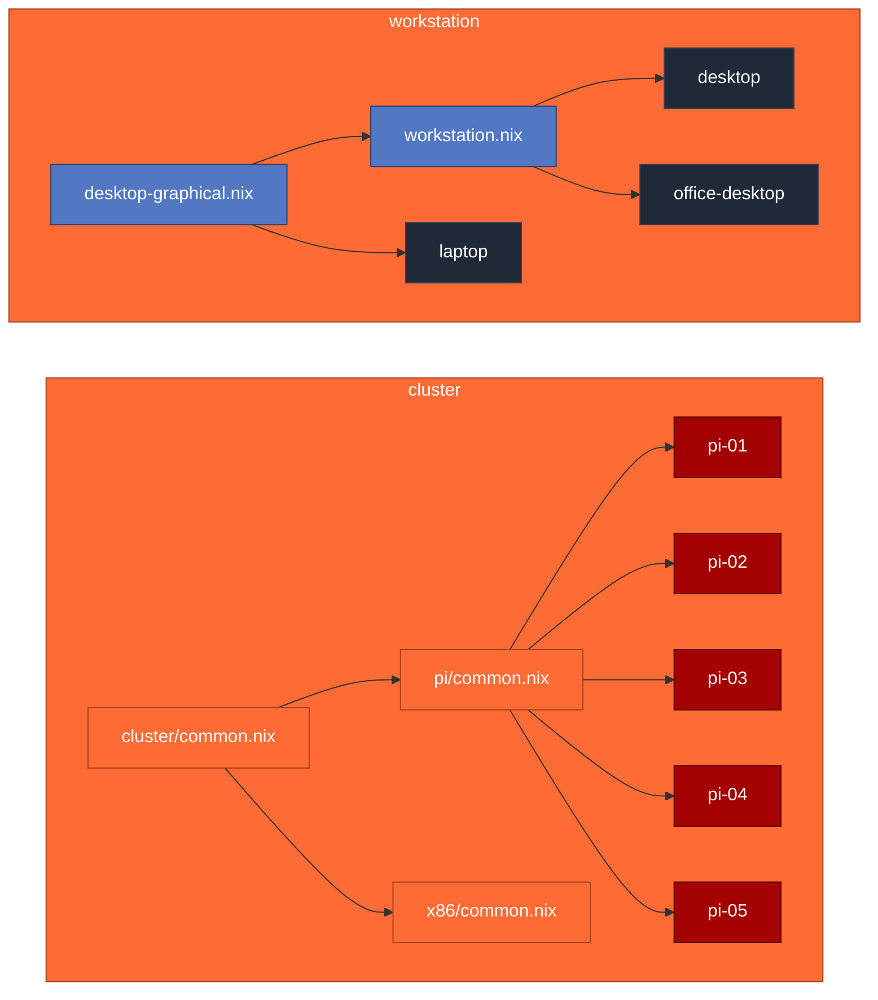

<div align="center">


# dotfiles


</div>

---

```bash
sudo nixos-rebuild switch --flake .#<host>
```

<table>
<tr>
<td valign="top" width="50%">

### Hosts

| host             | kind          | builder             |
| :--------------- | :------------ | :------------------ |
| `desktop`        | workstation   | `nixpkgs`           |
| `office-desktop` | workstation   | `nixpkgs`           |
| `laptop`         | workstation   | `nixpkgs`           |
| `wsl`            | side          | `nixpkgs`           |
| `cluster-pi-0X`  | incus node ×5 | `nixos-raspberrypi` |

</td>
<td valign="top" width="50%">

### Stack

| layer        | tool               |
| :----------- | :----------------- |
| OS           | NixOS 26.05        |
| User env     | Home Manager       |
| Compositor   | Hyprland (Wayland) |
| Login        | SDDM               |
| IME          | kime (dubeolsik)   |
| Orchestrator | Incus              |
| Secrets      | agenix             |

</td>
</tr>
</table>

### Architecture



### Layout

```text
hosts/
├── _shared/
│   ├── desktop-graphical.nix    # hyprland, sddm, kime, fonts
│   └── workstation.nix          # grub, operator CLIs
├── <host>/                      # per-machine
└── cluster/
    ├── common.nix               # incus, agenix, nftables
    ├── pi/                      # aarch64 (Pi 5 default)
    └── x86/                     # future joiners
secrets/                         # agenix recipients (repo-wide)
modules/common/
home-manager/
```
